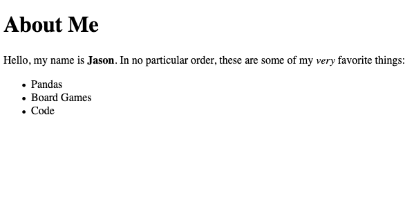
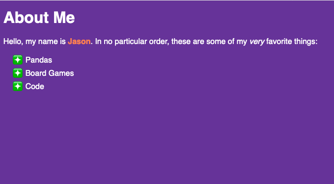
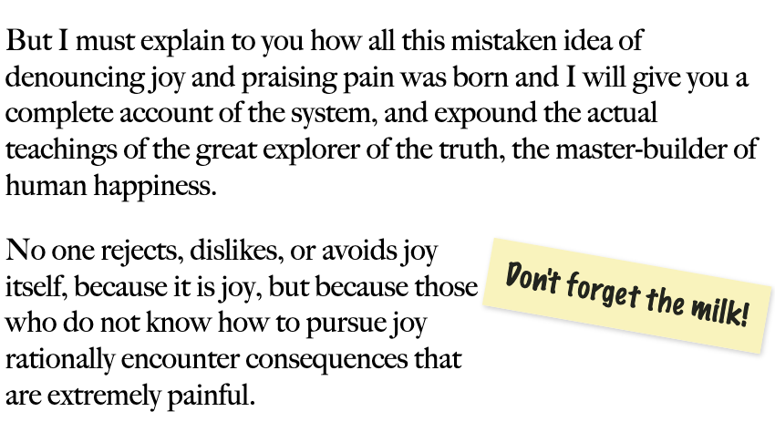

build-lists: true

# Intro to Web Development


---

# Jason L Perry

### CEO @ Suncoast Developers Guild

---

# Today's Learning Outcomes:

- Define the Web as it relates to the Internet.
- Explain the separation of responsibilities in each of the three foundational technologies that make up the web.
- Implement a simple static website with HTML and CSS.

---

# A Brief History of the Internet

---

# What is the Internet?

^ A global 'network of networks'
^ Wikipedia says: The Internet is the global system of interconnected computer networks that uses the Internet protocol suite to link devices worldwide.

---


[.footer:]

---

# Did Al Gore invent the Internet?


^ No, but he did popularize the use of the term: "Information Super Highway"

---


---

# U.S. Department of Defense

## Advanced Research Projects Agency (ARPA)[^1]


[^1]: Image: http://mercury.lcs.mit.edu/~jnc/tech/arpageo.html.

^ The closest thing to the birth of our modern Internet was ARPANET
^ There were a number of other networks, each speaking a different language, _or_ protocol.
^ What was needed was _internetwork communication_.

---

# TCP/IP[^2]


^ Internet protocol suite
^ Transmission Control Protocol (TCP) and the Internet Protocol (IP)

[^2]: Image: https://en.wikipedia.org/wiki/History_of_the_Internet

---

# The Web


---

# The "World Wide Web" is not the whole internet.

^ Besides the World Wide Web, what are some other Internet protocols you've used?

- FTP
- Usenet (NNTP)

---

# Email

[.column]

- SMTP
- POP3
- IMAP

[.column]


---

[.footer:]

# Bittorrent


---

# Cryptocurrencies


---

# Online Games


---

# HTTP


^ Sir Tim Berners-Lee invented the World Wide Web in 1989.

---

[.background-color: #ffffff]


---

[.build-lists: false]

- https://developer.mozilla.org/en-US/docs/Web/HTTP/Overview
- https://dev.opera.com/articles/http-basic-introduction/

---

# What is a website?

- HTML
- CSS
- JavaScript

^ HTML, CSS, JS and media assets transfered over HTTP to your Browser.

---

[.background-color: #ffffff]


---


^ What's the difference between front-end and back-end web development?

---

[.background-color: #eeeeee]


---

^ What is HTML?

^ HTML provides structure and content of a webpage, allowing you to add HTML, CSS, other media assets.

^ Very limited control over presentation before CSS was introduced later.

^ Screenshot on Amazon in 1994


---

^ What is CSS?

^ Allows you to style the elements on a page. Adding presentational aspects; controlling position, color, typography, additional images, etc.

^ Proposed in 1995, first standardized in 1996. Did not see wider implementation and adoption until 1998.


---

^ Work on CSS3 begain in 1999, which divided the standard into a number of modules. In varied stages of between draft and recommendation to this day.


---

^ What is JavaScript?


^ Allows you to turn a web page from a static document into a living, breathing interactive experience. Where content can be updated or animated, and respond dynamically to user input.

---


^ Invented by Brendan Eich in 1995, over just 10 days.

---

## [fit] HTML

^ HTML (HyperText Markup Language) is the most basic building block of the Web. It defines the meaning and structure of web content.

^ Text, marked with tags, that give semantic meaning to that text.

---

```
About Me
Hello, my name is Jason. In no particular order, these are some of my very favorite things:
Pandas
Board Games
Code
```

---

```html
<h1>About Me</h1>
<p>
  Hello, my name is <strong>Jason</strong>. In no particular order, these are
  some of my <em>very</em> favorite things:
</p>
<ul>
  <li>Pandas</li>
  <li>Board Games</li>
  <li>Code</li>
</ul>
```

---

[.background-color: #ffffff]


---

[.background-color: #1E1C1C]


---

^ Structure of an HTML Document.

```html
<!DOCTYPE html>
<html lang="en">
  <head>
    ...
  </head>
  <body>
    ...
  </body>
</html>
```

---

[.background-color: #1E1C1C]


---

```html
<a href="https://suncoast.io">Suncoast Developers Guild</a>
```

---

# Semantic Markup

- Maintainabiltiy
- Accessibility
- Search Engine Optimization (SEO)

^ Easier to author/update, and rationalize about in our heads
^ Provides context to people who might be using the page through non-tradition means, e.g. the blind, screen readers
^ SEO, gives context for search engine, to understand the importance and meaning of content on your pages

---

## [fit] CSS

---

^ Structure of a CSS document.

```css
body {
  font-family: sans-serif;
  background-color: rebeccapurple;
  color: white;
}

strong {
  color: coral;
}

li {
  list-style-type: "❇️";
  padding: 5px;
}
```

---

[.background-color: #ffffff]


---

[.background-color: #663399]


---

[.background-color: #ffffff]


---

```html
<style>
  strong {
    color: coral;
  }
</style>
```

^ The `style` attribute, and the `<style>` & `<link>` tags.

---

```html
<head>
  <!-- ... -->
  <link rel="stylesheet" href="./screen.css" />
</head>
```

---

```html
<!-- This is a comment, you won't see it rendered on the screen. -->
```

---

```html
<p>
  But I must explain to you how all this mistaken idea of denouncing joy and
  praising pain was born and I will give you a complete account of the system,
  and expound the actual teachings of the great explorer of the truth, the
  master-builder of human happiness.
</p>
<p class="note">Don't forget the milk!</p>
<p>
  No one rejects, dislikes, or avoids joy itself, because it is joy, but because
  those who do not know how to pursue joy rationally encounter consequences that
  are extremely painful.
</p>
```

---

```css
p {
  font-family: "Big Caslon", serif;
}

.note {
  float: right;
  font-family: "Marker Felt", script;
  background-color: #f9f3bd;
  color: #22241e;
  padding: 20px;
  box-shadow: 2px 2px 5px rgba(0, 0, 0, 20%);
  transform: rotate(10deg);
}
```

^ How selectors match your page to apply rules.

---

[.background-color: #ffffff]


---

## JavaScript

---

^ Structure of a JS document.

```html
<script>
  // Your JavaScript goes here
</script>
```

---

```html
<p>Hello, <span class="subject">World</span>!</p>

<script>
  let name = "Jason";
  document.querySelector(".subject").textContent = name;
</script>
```

---

# Hello, World!

---

# Hello, Jason!

---

## [fit] DEMO

## [fit] TIME

---

- Build a project.
